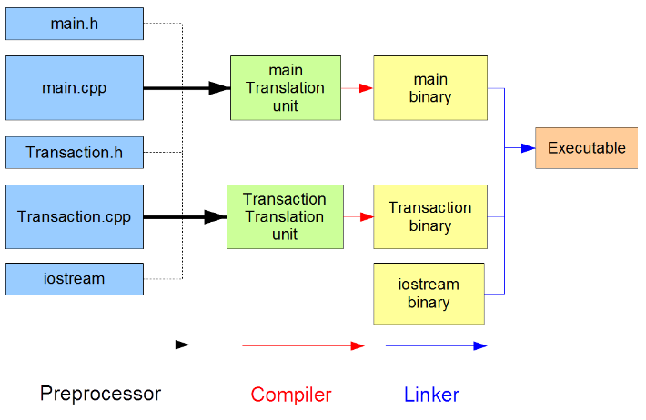

## Object-Oriented Programming

### Features of OOP
- OOP is a programming paradigm that uses "objects" to design applications and computer programs.
- OOP allows the programmer to create an object that combines data and functionality.
- Data often known as attributes or properties, and functionality often known as methods or behaviors.
- OOP makes it easy to map real-world problems and solutions.

<br />

### OOP Concepts
- **Class**: A blueprint for creating objects.
- **Object**: An instance of a class.
- **Inheritance**: Reusing an already existing design to design a better object.
- **Polymorphism**: Doing the same thing in different ways.
- **Encapsulation**: Packing the data and behavior together.
- **Abstraction**: Focusing on what needs to be done and ignore the irrelevant aspects of the problem.

<br />

### Features of C++
- C++ is a superset of the C language.
- A multi-paradigm programming language that supports procedural(can focus on distinct activities) and object-oriented(can focus on distinct objects).
- realistic, efficient, and flexible enough for demanding projects.

<br />

### C++ Compiler
- A C++ compiler is an operating system program that converts C++ language statements into machine language equivalents.

#### Stages of Compilation
1. **Preprocessing**: The preprocessor processes directives in the source code, such as #include for header files and #define for macro definitions, before it is passed to the compiler.
2. **Compilation**: The compiler translates the preprocessed source code into object code in binary format.
3. **Linking**: The linker combines the object files generated by the compiler into a single executable file.

 *source: [https://intro2oop.sdds.ca/A-Introduction/modular-programming#modules](https://intro2oop.sdds.ca/A-Introduction/modular-programming#modules)*

<br />

## Modular Programming
- Modular programming is a software design technique that emphasizes separating the functionality of a program into independent, interchangeable modules.
- Each module contains everything necessary to execute a specific aspect of the desired functionality.
- The modules can be developed, tested, and maintained independently.

### Modular Programming in C++
- In C++, a module is implemented using a header file and a source file.
- The header file contains the declarations of the functions and variables in the module.
- The source file contains the definitions of the functions and variables in the module.

<br />

### namespace
- A namespace is a declarative region that provides a scope for the identifiers declared within it.
- Namespaces are used to organize the code into logical groups and prevent naming conflicts.
- The `namespace` keyword is used to define a namespace.

```cpp
namespace my_namespace {
    int x;
    void foo();
}
```
