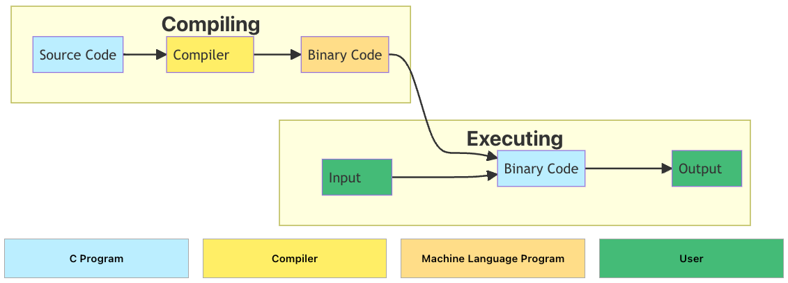

## Basic C Programming

### Features of C
- C is English-like
- C is quite compact - has a small number of keywords
- C is the lowest in level of the high-level languages
- C can be faster and more powerful than other high-level languages
- C programs that need to be maintained are large in number
- C is used extensively in high-performance computing
- UNIX, Linux and Windows operating systems are written in C and C++

<br />

### C Compiler
- A C compiler is an operating system program that converts C language statements into machine language equivalents.
 *source: [https://intro2c.sdds.ca/A-Introduction/compilers#the-c-compiler](https://intro2c.sdds.ca/A-Introduction/compilers#the-c-compiler)*

<br />

### C Program Structure
```c
#include <stdio.h> // Preprocessor directive
// #: This symbol at the beginning of a line is used for preprocessor commands.
// <stdio.h>: This is a header file. (stdio.h stands for "standard input-output header")

int main() { // Function header
// int main() {: 'int' means that this function will return an integer. 
// 'main()' is a special function that always runs first when your program starts.
    printf("Hello World!"); // Function body
    // printf("Hello World!");: 'printf' is a function used to print text on your screen.
    return 0; // Function footer
    // 'return' ends the function and sends back (or "returns") an integer value
    //  in this case, 0 indicates that everything went okay.
}
// }: This closes off our main function - everything between { and } belongs to main().
```

<br />

### Escape Sequence / Comments
| Escape Sequence | Description            |
|-----------------|------------------------|
| `\n`              | Line break             |
| `\"`              | "                      |
| `\\`              | \                      |
| `\t`              | Tab                    |
| `//`              | Single line comment    |
| `/* */`           | Multi-line comment     |

