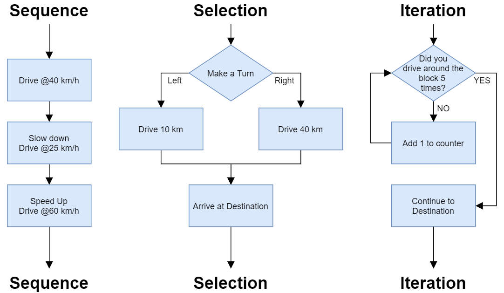
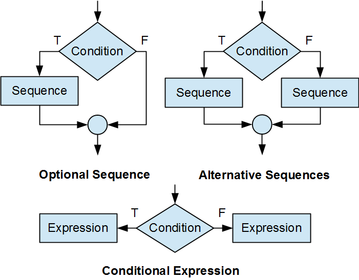
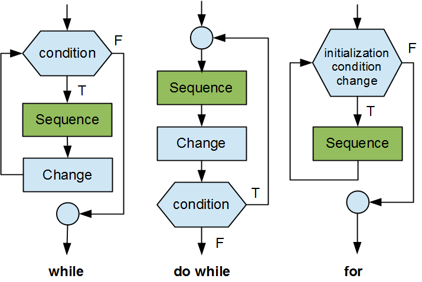
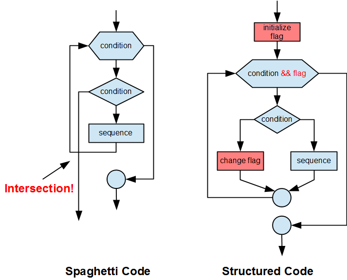

## Logic

### Structured programming
Structured programming is a way of writing code that focuses on making it easy to read and change. It breaks down a program into smaller parts using functions and blocks. It uses three main parts: sequence, selection, and repetition. The aim is to make the code simple and manageable.

<br />

- Sequence: This is the normal flow where statements are executed line by line in order.
- Selection: This is implemented with control statements like "if", "if-else", and "switch". It allows the program to choose between different paths based on certain conditions.
- Repetition: This is implemented with loops like "for", "while", and "do-while". It allows certain parts of the code to be repeated several times.



<br />

### Preliminary Design
Preliminary Design is the early stage of designing where you create a basic plan of what you want to make, without all the small details.

- Pseudocode: It's like a draft of your program, written in simple English. It helps you plan the steps your program will take, without using real code.
- Flowcharts: These are pictures with symbols and arrows that show the steps and flow of your program. They help you see and share your plan before you start coding.

<br />

### Selection constructs
The C language supports three selection constructs:
- optional path
- alternative paths
- conditional expression
The flow charts for these three constructs are shown below:



<br />

#### Optional Path
It is a programming term that refers to a part of the code which only runs if a specific condition is met. In other words, this part of the code is optional and only runs when the condition is true.
```c
if (condition)
  sequence
```
Here, the condition could be a relational expression or a logical expression. The sequence may be a single statement or a code block.

##### Single Statement
```c
if (likePizza == 1)
  printf("I like pizza\n");
```
##### Code Block (more than a single statement)
```c
if (likePizza == 1)
{
  printf("I like pizza\n");
  printf("I want more pizza\n");
}
```

<br />

#### Alternative Paths
The C language supports two ways of describing alternative paths: an binary select construct and a multiple selection construct.

##### Binary Selection
```c
if (condition)
  sequence1
else
  sequence2
```
Here, the condition could be a relational expression or a logical expression. The sequence may be a single statement or a code block. The program executes the sequence following the if only if the condition is true. The program executes the sequence following the else only if the condition is false.

##### Single Statement
```c
if (likePizza == 1)
  printf("I like pizza\n");
else
  printf("I hate pizza\n");
```

##### Code Block (more than a single statement)
```c
if (likePizza == 1)
{
  printf("I like pizza\n");
}
else
{
  printf("I hate pizza\n");
  printf("I don't want pizza\n");
}
```

##### Multiple Selection
For three alternative paths, we append an if else construct to the else keyword.
```c
 if (condition)
  sequence
 else if (condition)
  sequence
 else
  sequence
```
If the first condition is true, the program skips the second and third sequences. If the first condition is false, the program skips the first sequence and evaluates the second condition. The program executes the second sequence only if the first condition is false and the second condition is true. The program executes the third sequence and skips the first two only if both conditions are false.

##### Compound Conditions
The condition in a selection construct may be a compound condition. A compound condition takes the form of a logical expression

```c
if (age > 12 && age < 16)
{
  printf("Student Fare - no id required\n");
}
else if (age > 15 && age < 20)
{
  printf("Student Fare - id is required\n");
}
else if (age < 13)
{
  printf("Child ride for free!\n");
}
else if (age >= 65)
{
  printf("Senior Fare - id is required\n");
}
else
{
  printf("Adult Fare\n");
}
```

##### Case-by-Case
The "switch" structure in programming checks a condition, which can be simple or complex, and matches it with different fixed values or results. Here is how it looks:
```c
switch (question)
{
case choice1:
       do something
       break;
case choice2:
       do something else
       break;
default:
       do another thing
}
```
"switch" is like a multi-choice quiz. You have a question (condition) and many choices (cases). If your question matches 'choice1', you will do something. If it matches 'choice2', you will do something else. If it doesn't match any choices, you will do another thing (default). "break" means you stop and move on. If there is no "break", you will also do the things for the next choice.

<br />

#### Conditional Expression
The conditional expression is a ternary operator that takes three operands. It is used to replace an if else construct that assigns a value to a variable based on a condition. The conditional expression has the following form:
```c
condition ? expression1 : expression2
```
First, it checks a condition. If it's true, it uses the first expression, and if it's false, it uses the second. Only the expression that matches the condition is used.

```c
// Example
int a = 10, b = 20;
int max = (a > b) ? a : b;
```
In this example, (a > b) is the condition. If a is greater than b, the expression a is used, and max becomes a. If a is not greater than b, the expression b is used, and max becomes b. Since 20 is greater than 10, in this case, max would become 20.

<br />

### Iteration constructs
In C programming, there are three ways to repeat actions: 'while', 'do while', and 'for'. Each method needs a set-up step, a condition to check, and a step to change things for the next round. If we forget to change things, or the condition is always true, the action will repeat forever, creating an infinite loop.


#### while
```c
/*
  while (condition)
  {
      sequence
  }
*/

int i = 1;
while (i <= 5) {
    printf("%d ", i);
    i++;
}
```

#### do while
```c
/*
  do {
      sequence
  } while (condition);
*/

int i = 1;
do {
    printf("%d ", i);
    i++;
} while (i <= 5);
```

#### for
```c
/*
  for (initialization; condition; change)
  {
      sequence
  }
*/

for (int i = 1; i <= 5; i++) {
    printf("%d ", i);
}
```

In all three examples, the loop prints the numbers 1 to 5. The while loop checks the condition before the loop starts, the do/while loop checks it after the loop runs once, and the for loop includes the initialization, condition, and increment all in one line.

<br />

### Flags
Flagging in programming is a technique to follow the single-entry single-exit principle, making loops simpler. Flags, either true or false, control the flow of iterations, deciding whether to continue or stop, so avoiding crossed paths and improving the overall design and maintainability of the code.

