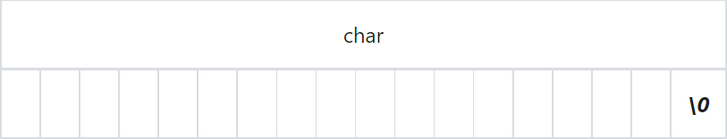
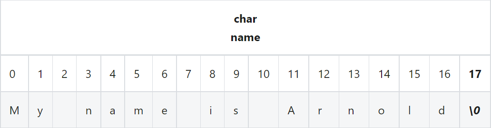

## Array

### Definition
An array is a type of data structure that can store a fixed-size ordered group of elements of the same type.

<br />

### Elements
Each item stored in an array is called an element. These elements are accessed by their numerical index. The first element starts at index 0.

> In C language, the computer doesn't check if we are trying to access a spot in the array that doesn't exist. So, it's up to us, the programmers, to make sure we don't use an index that is outside the size of the array. If our array has 5 spots, we need to make sure we only try to access spots 0 to 4.

<br />

### Initialization
To initialize an array, you define the type of elements it will hold, the name of the array(identifier), and the size within square brackets. For example:
```c
// type identifier[size];
int numbers[5];
```
This means you have an array named 'numbers' that can hold 5 integers.

<br />

### Accessing Elements
Accessing Elements: To access an element in the array, you refer to its index. For example:
```c
numbers[0] = 10;
```
This means you're putting the integer '10' in the first spot in the 'numbers' array.

<br />

### Initializing with Values
You can initialize an array with values at the same time you declare it. Like this:
```c
// type identifier[ size ] = { value, ... , value };
int numbers[5] = {1, 2, 3, 4, 5};
```
This means you have an array named 'numbers' that holds five integers, and you've put 1 in the first spot, 2 in the second spot, and so on.
> Remember, arrays in C are zero-indexed, which means the first element is at index 0, the second element is at index 1, and so forth. So if you have an array of size 5, the indices will be 0, 1, 2, 3, and 4.

<br />

### Parallel Arrays
These are two or more arrays where the related data is stored at the same index in each array. For example:
```c
#include <stdio.h>

int main(void)
{
    int i;
    int sku[]      = { 2156, 4633, 3122, 5611};
    double price[] = { 2.34, 7.89, 6.56, 9.32};
    const int n    = 4;

    printf("  SKU Price\n");
    for (i = 0; i < n; i++)
    {
        printf("%5d $%.2lf\n", sku[i], price[i]);
    }

    return 0;
}
```
Output of the above program:

```c
  SKU Price
 2156 $2.34
 4633 $7.89
 3122 $6.56
 5611 $9.32
```
The sku[] array holds the key data, while the price[] array holds the value data. Note how the elements of parallel arrays with the same index make up the fields of a single record of information.

Parallel arrays are simple to process. For example, once we find the index of the element that matches the specified sku, we also have the index of the unit price for that element.

<br />

### Character Strings
A string in programming is a sequence of characters, stored in an array, with an extra special character at the end, called the null terminator, represented as '\0'.

This null terminator indicates the end of the string. It's value is always 0, meaning all its bits are zeros.

The position of this null terminator also tells us the length of the string. However, the total memory used by the string includes an extra space for this null terminator, so it's one more than the number of actual characters in the string.

#### Syntax
We need to allocate memory for one additional byte to provide room for the null terminator:
```c
const int NCHAR = 17;
char name[NCHAR + 1] = "My Name is Arnold";
```
We use the "%s" conversion specifier and the address of the start of the character string to send its contents to standard output:
```c
printf("%s", name);
```